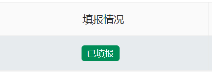

---
online列表自定义slot Yoko.Shao 2024-11-16
---

# online列表自定义slot

**支持任意Vue Template代码！**

> 如果不知道slot是什么，可以先学习下：[插槽](https://v2.cn.vuejs.org/v2/guide/components-slots.html)
> 
> [antd vue Table 表格](https://1x.antdv.com/components/table-cn/#components-table-demo-basic-usage)


**插槽上下文属性**

* `text`：**当前字段的值**
* `record`：**当前行数据**
* `vm`：**当前online列表组件实例**
* `table`: 当前表格对象
* `columns`: 当前columns设置列表
* `dataSource`: 当前表格数据列表
* `pagination`: 当前分页参数
* `loading`: 加载状态
* `rowSelection`: 列选择配置对象
* `handleTableChange`: 处理分页、排序、筛选变化的方法 `handleTableChange(pagination, filters, sorter)`
* `scroll`: 列滚动控制
* `getFormatDate`: 获取格式化的日期方法 `getFormatDate(text)`
* `getPcaText`: 获取区域代码翻译方法 `getPcaText(code)`
* `handleEdit`: 调用编辑方法 `handleEdit(record)`
* `handleTrack`: 调用流程历史信息方法 `handleTrack(record)`
* `handleDetail`: 调用详情方法 `handleDetail(record)`
* `handleProcess`: 调用流程审批方法 `handleProcess(record)`
* `handleClaim`: 调用流程签收方法 `handleClaim(record)`
* `startProcess`: 调用流程发起方法 `startProcess(record)`
* `handleDeleteOne`: 调用删除方法 `handleDeleteOne(record)`
* `selectEntruster`: 调用流程委托方法 `selectEntruster(record)`
* `finishProcess`: 调用流程快速结束方法 `finishProcess(record)`
* `callBackProcess`: 调用流程取回方法 `callBackProcess(record)`
* `cgButtonLinkList`: 自定义按钮列表（表格行操作列，更多下面的按钮）
* `cgButtonLinkHandler`: 调用自定义按钮处理器 `await cgButtonLinkHandler(record, buttonCode, optType)`
* `onClearSelected`: 调用清空选中行方法 `onClearSelected()`
* `settingColumns`: 当前列表如果筛选了展示列，将在这里返回列表
* `defColumns`: 当前列表所有列列表
* `handleAdd`: 调用添加方法 `handleAdd()`
* `handleImportXls`: 调用导入方法 `handleImportXls()`
* `handleExportXls`: 调用导出方法 `handleExportXls()`
* `cgButtonList`: 和新增按钮一行的自定义按钮列表
* `cgButtonJsHandler`: 和新增按钮一行的自定义按钮列表处理器 `await cgButtonJsHandler(buttonCode)`
* `cgButtonActionHandler`: 和新增按钮一行的自定义按钮列表处理器 `cgButtonActionHandler(buttonCode)`
* `superQuery`: 高级查询对象
* `handleSuperQuery`: 调用高级查询方法 `handleSuperQuery(params, matchType)`
* `handleDelBatch`: 调用批量删除方法 `handleDelBatch()`
* `queryParam`: 当前查询参数对象
* `searchByquery`: 调用搜索方法 `searchByquery()`
* `queryInfo`: 搜索项渲染列表（online列表配置了多少个搜索项，都在这里）
* `buttonSwitch`: 当前按钮开关状态（控制按钮显隐、是否禁用等）
* `dictOptions`: 当前搜索项的字典翻译数据列表
* `toggleSearchStatus`: 搜索收起展开状态
* `bpmStatusFieldName`: BPM状态字段名称
* `hasBpmStatus`: 是否有BPM状态字段
* `getFullFormData`: 获取完整表单数据方法 `await getFullFormData(id, tableName, desFormCode)`
* `openAnyForm`: 打开任意表单方法 `await openAnyForm(code, id, mode = 'add', title = '表单', newFormData = {})`
* `sendTemplateAnnouncement`: 发送模板公告方法 `sendTemplateAnnouncement(fromUser, toUser, title, templateCode, formData, THIRD_APP_TYPE, msgAbstract)`
* `setQueryOptions`: 重置查询参数方法 `setQueryOptions(fields = [], options = {})`
* `setQueryDict`: 设置查询字典方法 `setQueryDict(fields = [], dict = '')`
* `getQueryItem`: 获取查询项方法 `getQueryItem(fields = [])`
* `loadData`: 刷新列表 `loadData()`
* `searchReset`: 重置搜索 `searchReset()`
* `moment`: moment对象


# 使用示例

实例一：让字段渲染`a-tag`标签，可以点击绑定打开详情表单



自定义scopedSlots中填写（随便写）：

```html
fill_status
```

slot渲染Vue代码：

```html
<a-tag v-if="text === '已填报'" color="#008D57" @click="handleDetail(record)">{{ text }}</a-tag>
<a-tag v-else color="#E34D59">{{ text }}</a-tag>
```
